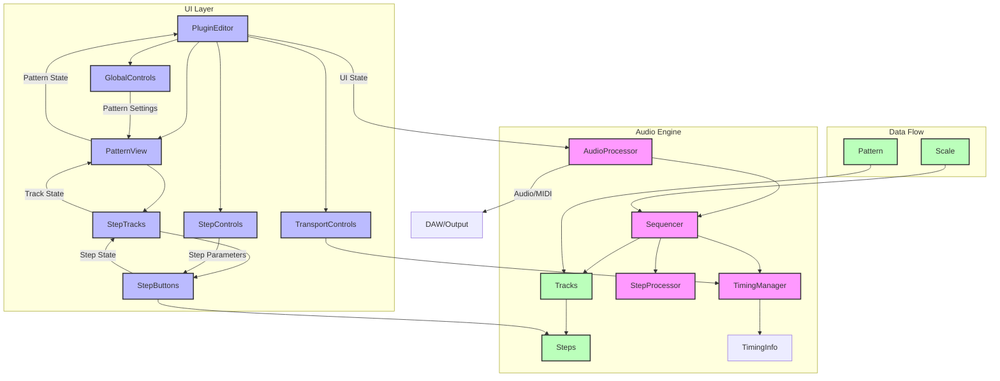

# Sirkus Architecture

## Component Descriptions

### Audio Engine
- **AudioProcessor**: Main JUCE plugin processor handling audio/MIDI I/O
- **Sequencer**: Core sequencing engine managing tracks and timing
- **TimingManager**: Handles synchronization with host or internal clock
- **StepProcessor**: Processes step data into MIDI events
- **Tracks**: Collection of sequencer tracks
- **Steps**: Individual step data within tracks

### UI Layer
- **PluginEditor**: Main plugin UI container
- **GlobalControls**: Pattern-wide settings (time signature, length)
- **PatternView**: Main pattern editing interface
- **StepControls**: Step parameter editing interface
- **StepTracks**: Track containers with step buttons
- **StepButtons**: Individual step UI elements
- **TransportControls**: Playback control interface

### Data Flow
- **Pattern**: Pattern data structure
- **Scale**: Musical scale information
- **Data Flow**: Shows how data moves between components

## Key Features
- MIDI sequencing with multiple tracks
- Host sync or standalone timing
- Scale-based note input
- Pattern-based sequencing
- Modular UI architecture
- Extensible track system