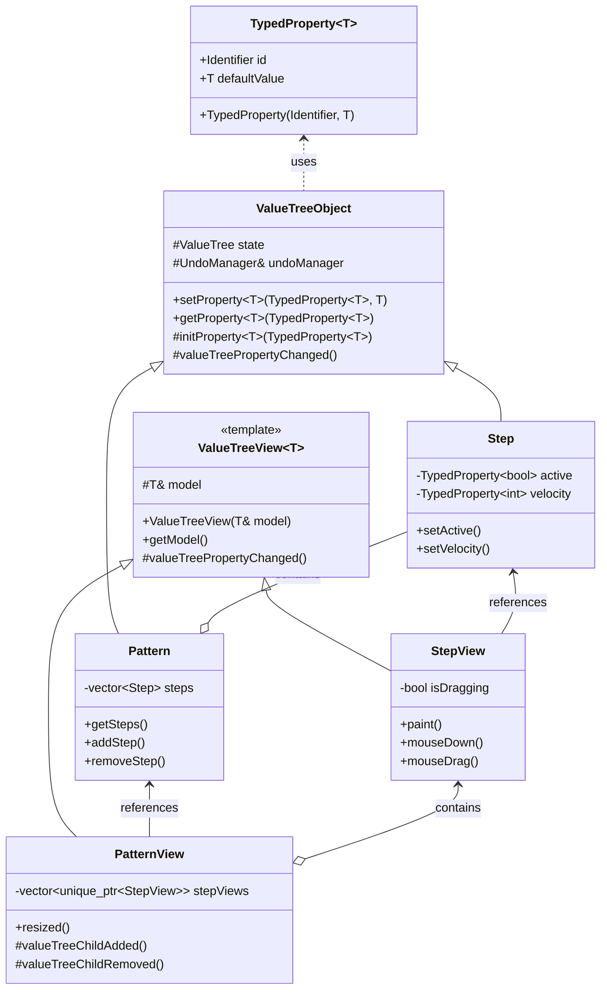

Sirkus uses a Model/View pattern for building UIs. The models are found under `Sirkus::Core` namespace and are what we call call business objects, they handle the core logic. Any class that inherits from `ValueTreeObject` can be thought of as a model in this context.

The Views can be found in the `Sirkus::UI` namespace and inherit from ValueTreeView. 
If you are familiar with the MVC pattern then ValueTreeView can be thought of as the view and the controller combined. Typically in MVC the View is made up of some declarative layout code often implemented in some domain specific language (e.g. HTML, XML, SwiftUI). As we are using JUCE and the UI is just plain C++ abstracting the view has less obvious benefits and adds complexity. There are caveats to this that will be explored towards the end of this document in the section [ValueTreeView - UI Component Patternclass Square~Shape~{
            int id
            List~int~ position
            setPoints(List~int~ points)
            getPoints() List~int~
        }
        
        Square : -List~string~ messages
        Square : +setMessages(List~string~ messages)
        Square : +getMessages() List~string~
](ValueTreeView%20-%20UI%20Component%20Pattern.md#When to Consider Alternative Patterns)



## Core Architecture

### ValueTreeObject Base
The foundation of this pattern is the `ValueTreeObject` base class which provides:
- Type-safe property access through the `TypedProperty` template
- Integrated undo/redo support via JUCE's `UndoManager`
- Automatic ValueTree listener management
- Hierarchical state structure

```cpp
// Example of type-safe property declaration
class Step : public ValueTreeObject {
private:
    TypedProperty<bool> activeProperty{ IDs::active, false };
    TypedProperty<int> velocityProperty{ IDs::velocity, 64 };

public:
    Step(ValueTree parentState, UndoManager& um)
        : ValueTreeObject(parentState, IDs::step, um)
    {
        initProperty(activeProperty);
        initProperty(velocityProperty);
    }
};
```

### Model-View Relationship
Views hold references to fully constructed model objects, leveraging the type-safe property system:
```cpp
class StepView : public ValueTreeView<Step> {
    void mouseDown(const MouseEvent&) override {
        // Type-safe property access through model
        model.setProperty(activeProperty, !model.getProperty(activeProperty));
    }
};
```

## Key Features

### Type-Safe Properties
The `TypedProperty` template provides:
- Compile-time type checking
- Default values
- Clear property ownership
- Simplified property access

### Undo Management
All state changes automatically participate in undo/redo:
```cpp
void setVelocity(int newVelocity) {
    // Automatically uses UndoManager passed to ValueTreeObject
    setProperty(velocityProperty, newVelocity);
}
```

### State Hierarchy
ValueTreeObject manages parent-child relationships:
```cpp
Pattern::Pattern(ValueTree parentState, UndoManager& um)
    : ValueTreeObject(parentState, IDs::pattern, um)
{
    // Children automatically added to parent's ValueTree
    for (int i = 0; i < 16; ++i)
        steps.push_back(std::make_unique<Step>(state, um));
}
```

## Usage Guidelines

### Property Declaration
Define properties using TypedProperty:
```cpp
// In header
TypedProperty<float> panProperty{ IDs::pan, 0.0f };
TypedProperty<bool> muteProperty{ IDs::mute, false };

// In constructor
initProperty(panProperty);
initProperty(muteProperty);
```

### View Construction
Views should be constructed with references to existing models:
```cpp
Pattern pattern(parentState, undoManager);
PatternView patternView(pattern);
```

### State Changes
Always use the type-safe property methods:
```cpp
// Good
setProperty(velocityProperty, 64);

// Avoid - bypasses type safety
state.setProperty("velocity", 64, &undoManager);
```

## Common Patterns

### Composite Models
When creating composite objects, maintain the ValueTree hierarchy:
```cpp
class Track : public ValueTreeObject {
    std::vector<std::unique_ptr<Pattern>> patterns;
    
    void addPattern() {
        // New pattern's state automatically added as child
        patterns.push_back(std::make_unique<Pattern>(state, undoManager));
    }
};
```

### UI Updates
Views can respond to specific property changes:
```cpp
void valueTreePropertyChanged(ValueTree& tree, const Identifier& property) override {
    if (property == velocityProperty.id)
        updateVelocityDisplay();
    else if (property == activeProperty.id)
        updateActiveState();
}
```

This architecture provides a robust foundation for building complex JUCE applications with proper state management, undo support, and type safety, while maintaining a clean separation between models and views.

# When to Consider Alternative Patterns

## When MVC Might Be Better

### Complex User Input Handling
If your UI has complex input validation, formatting, or transformation requirements, a dedicated Controller can help:
```cpp
class StepController {
    void handleVelocityInput(const String& input) {
        // Parse string input
        // Validate range
        // Apply scaling/transformation
        // Update model
    }
};
```

### Multiple Views Sharing Input Logic
When several views need to handle user input in the same way, MVC helps avoid duplicating the logic:
```cpp
// Multiple views can share this controller
class PatternInputController {
    void handleStepToggle(int trackIndex, int stepIndex) {
        // Input validation
        // Undo management
        // Update model
    }
};
```

### Complex Undo/Redo Requirements
When you need sophisticated command history:
```cpp
class PatternEditController {
    std::unique_ptr<UndoManager> undoManager;
    
    void toggleStep(int index) {
        undoManager->beginNewTransaction();
        // Create and execute command
        // Handle undo stack
    }
};
```

## When MVVM Might Be Better

### Complex Data Transformations
When your view needs data in a significantly different form than your model stores it:
```cpp
class StepViewModel {
    // Transforms model's 0-127 velocity into percentage
    float getVelocityPercentage() {
        return (model.getVelocity() / 127.0f) * 100.0f;
    }
    
    // Transforms model's boolean into enum state
    StepState getStepState() {
        return model.isActive() 
            ? (model.isAccented() ? StepState::Accented : StepState::On)
            : StepState::Off;
    }
};
```

### Multiple View States
When views need to maintain UI state separate from model data:
```cpp
class PatternViewModel {
    bool isEditing = false;
    int selectedStepIndex = -1;
    std::vector<bool> stepHoverStates;
    
    void updateSelection(int index) {
        selectedStepIndex = index;
        notifyViewStateChanged();
    }
};
```

### Complex Data Binding
When you need sophisticated two-way binding between UI controls and data:
```cpp
class StepViewModel {
    Property<int> velocity;
    Property<bool> active;
    
    void bind(Slider& slider) {
        slider.bindValue(velocity);
        velocity.onChanged = [this](int newValue) {
            // Transform and validate before updating model
        };
    }
};
```

## When ValueTreeView Might Not Be Enough

1. **Multiple Visual Representations**
   - If the same data needs very different visual representations
   - When views need to switch between different visual states
   - When you need to support different UI themes or layouts

2. **Complex View State**
   - Views that need to maintain a lot of UI-specific state
   - Selection systems
   - Drag and drop interactions
   - Multi-touch gesture handling

3. **Validation and Error Handling**
   - When you need sophisticated input validation
   - When you need to manage and display error states
   - When you need to coordinate validation across multiple fields

4. **Cross-Cutting Concerns**
   - When you need to implement features that span multiple views
   - Authentication/authorization
   - Logging/analytics
   - Complex undo/redo systems

In these cases, you might want to:
1. Add a ViewModel layer on top of ValueTreeView
2. Combine ValueTreeView with a Controller
3. Use a different pattern entirely

The key is to recognize when the simplicity of ValueTreeView needs to be augmented with additional patterns to meet your application's needs.